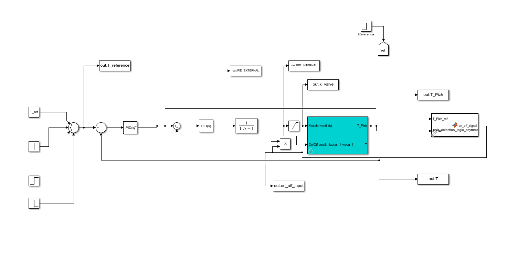
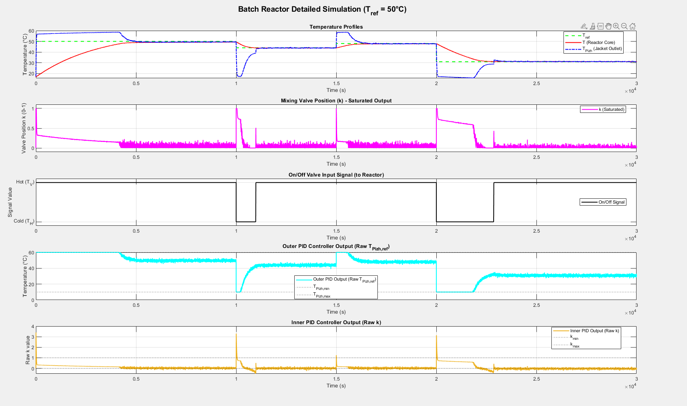

# Bioreactor Temperature Control

This project implements a cascade control system for regulating the temperature of a batch reactor. The control system is designed to follow a reference temperature profile while respecting operational constraints.

## Project Overview

The system consists of a batch reactor with a heating/cooling jacket. The temperature of the reactor core is controlled by manipulating the temperature of the water flowing through the jacket. This is achieved by mixing hot and cold water with a mixing valve and selecting the hot or cold water inlet with on/off valves.

The main control objectives are:

*   Track a given reference temperature profile for the reactor core.
*   Maintain the jacket temperature within a safe operating range.
*   Minimize the switching frequency of the on/off valves.

## System Dynamics

The system is described by a set of differential equations that model the heat transfer between the jacket, the reactor core, and the environment. The mathematical model is provided in the `navodila.pdf` document (in Slovenian).

---

## Governing Equations

The temperature dynamics of the batch bioreactor are governed by the following system of ordinary differential equations:

$$
\begin{aligned}
C_R \frac{dT}{dt} &= Q_{in} (T_{in} - T) + k_A (T_{\text{jacket}} - T) + Q_{r} \\
C_J \frac{dT_{\text{jacket}}}{dt} &= F (T_{in, J} - T_{\text{jacket}}) - k_A (T_{\text{jacket}} - T)
\end{aligned}
$$

Where:
- $T$ = Reactor core temperature (°C)
- $T_{\text{jacket}}$ = Jacket (heat exchanger) temperature (°C)
- $C_R$ = Heat capacity of reactor contents (J/K)
- $C_J$ = Heat capacity of jacket (J/K)
- $Q_{in}$ = Inlet flow rate to reactor (kg/s)
- $T_{in}$ = Inlet temperature to reactor (°C)
- $k_A$ = Overall heat transfer coefficient × area (W/K)
- $Q_{r}$ = Heat generated/consumed by reaction (W)
- $F$ = Jacket flow rate (kg/s)
- $T_{in, J}$ = Inlet temperature to jacket (°C)

---

## Control Strategy

A cascade control architecture is employed to meet the control objectives. This strategy consists of two nested control loops:

*   **Inner Loop:** Controls the jacket temperature (`TPizh`). This loop is fast and its primary purpose is to reject disturbances, such as changes in the inlet water temperature, before they affect the reactor core.
*   **Outer Loop:** Controls the reactor core temperature (`T`). This loop is slower and provides the setpoint for the inner loop.

### Why Cascade Control?

Cascade control is particularly effective for this application due to the following reasons:

*   **Disturbance Rejection:** The inner loop quickly compensates for disturbances in the jacket temperature, preventing them from propagating to the reactor core. This results in superior tracking of the reference temperature.
*   **Improved Performance:** By controlling the jacket temperature, the inner loop linearizes the process dynamics from the perspective of the outer loop. This allows for a more aggressive tuning of the outer controller, leading to faster response times and reduced overshoot.
*   **Constraint Handling:** The operational constraints on the jacket temperature can be easily enforced by limiting the setpoint of the inner loop.

## Implementation

The control system was implemented and simulated in **MATLAB/Simulink**. The Simulink model (`sarzni_reaktor1_2.slx`) contains the implementation of the cascade controller, the reactor model, and the logic for the on/off valves.

The file `reactortest.m` is a MATLAB script used to run the simulation and visualize the results.

## Simulation Results

The simulation results demonstrate the effectiveness of the cascade control strategy. The reactor core temperature closely follows the reference profile, and the jacket temperature remains within the specified limits. The control signals for the mixing valve and the on/off valves are also shown in the simulation plots.

